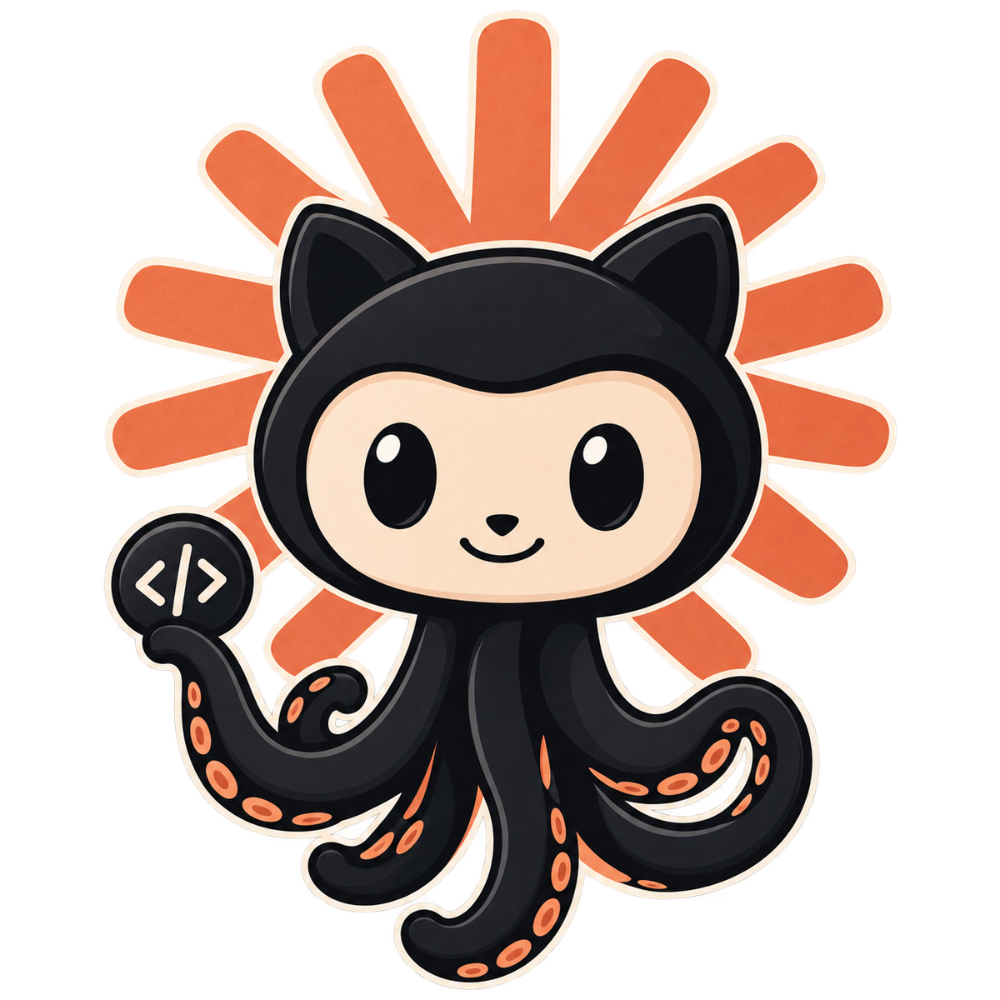

<p align="center">
  
</p>

# Claude + GitHub Status

Toolbar extension that shows the current state of https://status.claude.com and
https://www.githubstatus.com at a glance.

- The icon is the octocat wrapped in a Claude burst. Its **spokes** are recoloured to the
  worst status across both services: **coral** when everything is operational, **amber** on a
  minor issue, **orange/red** on a partial or major outage, **deep red** on a critical outage,
  **blue** during maintenance, **grey** if a status page can't be reached.
- No badge. Chrome anchors its badge bottom-right at a fixed size, which covers ~52% of a 16px
  action icon — and because the badge only appears when something is wrong, it blotted out the
  icon exactly when you wanted to read it. Hover names both services and their status instead.
- Click for a popup: one stacked section per service with its overall status, any active
  incident or scheduled maintenance, and a per-component list.
- Polls both `/api/v2/summary.json` endpoints every 2 minutes, plus once whenever you open the
  popup. No accounts, no tracking, no other network access.
- Requests no host permissions. Both status APIs send `Access-Control-Allow-Origin: *`, so the
  service worker can fetch them without being granted access to any site.

## What's shown per service

**Claude** — every component the status page reports (claude.ai, Console, API, Claude Code, …).

**GitHub** — the components that block work: Git Operations, API Requests, Actions, Packages,
Webhooks. The rest (Pages, Issues, Pull Requests, Copilot, Codespaces) are hidden while they're
operational and appear automatically if they degrade, so an outage is never silently dropped.

## The "Open Incident" state

Statuspage rolls up *components*, not *incidents*. Both pages can report an unresolved incident
while the overall indicator still says `none`, because the incident isn't attached to any
component — which would leave the icon all-clear during a live outage. When that happens the
service is escalated to its worst unresolved incident impact and labelled **Open Incident**
(rather than "Critical Outage", which would contradict the green components beside it).

If a page already reports a problem, its own indicator is trusted as-is and never escalated.

## Install

1. Go to `chrome://extensions` and turn on **Developer mode** (top right).
2. Click **Load unpacked** and select this folder.
3. Click the puzzle-piece icon in the toolbar and **pin** it so it sits next to your
   bookmarks bar favicons.

It stays installed across restarts. Chrome shows a "disable developer mode extensions" nag on
some builds — dismissing it is fine, or pack it as a `.crx` if you want that gone.

## Files

| File | Role |
|---|---|
| `manifest.json` | MV3 manifest — the only permissions are `alarms` and `storage` |
| `background.js` | Polls both APIs, recolours the icon with OffscreenCanvas, sets the tooltip |
| `popup.html` / `popup.js` | The dropdown UI, light/dark aware |
| `icons/mark.png` | 256px artwork the runtime recolours (spokes are hue-swapped, the cat isn't) |
| `icons/mark-source.png` | Full-resolution 1222px original, kept as the source of truth |
| `icons/icon*.png` | Static fallback icons, generated from the artwork at operational coral |

## Adding another Statuspage service

Both services go through one parser, so adding a third is a single entry in `SERVICES` at the
top of `background.js`. No manifest change is needed — Statuspage sends
`Access-Control-Allow-Origin: *`, so no host permission is required:

```js
{ key: "vercel", label: "Vercel",
  api: "https://www.vercel-status.com/api/v2/summary.json",
  page: "https://www.vercel-status.com/",
  components: ["Edge Network"] }  // omit to show every component
```
